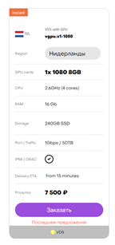
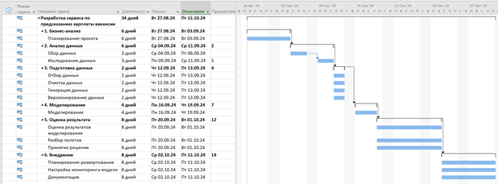

**1.  Бизнес-анализ (Business Understanding)**

В первую очередь необходимо определиться с целями и скоупом проекта.

Для этого нужно найти ответы на следующие вопросы:

- _Организационная структура: кто участвует в проекте со стороны заказчика сервиса, кто будет основным пользователем?_

_Ответ:_

_Неактуально, только я._

- _Собираем контакты, создаем рабочие чаты._

_Ответ:_

_Неактуально, только я._

- _Какова бизнес-цель проекта? Например, уменьшение оттока клиентов._

**_Ответ:_**

К 13.10.24 разработать сервис по предсказанию стоимости зарплаты конкретной вакансий с детализацией обоснования такой стоимости.

- _Существуют ли какие-то уже разработанные решения? Если существуют, то какие и чем именно текущее решение не устраивает?_

**1.1 Текущая ситуация (Assessing current solution)**

Оцениваем, хватает ли ресурсов для проекта.

- Есть ли доступное железо или его необходимо закупать?

**Ответ:**

Для непосредственно разработки есть. (RTX 3090, не думаю, что в итоге будет потребность больше, чем 24 гб видеопамяти)

Для условной интеграции я рассматриваю два варианта:

1. Если объем модели будет небольшой, то можно рассмотреть вариант с хостингом (RuVDS, Selectel и т.д.) сервера с видеокартой, на котором будет развернут сервис.
2. Если объем модели будет значительным, то есть провайдеры вроде Sbercloud (ML Space), у которых есть помоментная тарификация использования их мощностей. В случае обучения и использования модели в определенные моменты в самый раз, на такой случай.

Итоговые затраты на обслуживание сервиса я вижу до 10000 руб в месяц и меньше по причинам:

- 1. Хостинг с типовой видеокартой обойдется примерно в такую сумму:
  2. Для моделей больших размеров, как я говорил, подойдет хостинг с помоментной тарификацией, где суммарное время обучения и запроса к сервису будут меньше 10000.

 

- Где и как хранятся данные, будет ли предоставлен доступ в эти системы, нужно ли дополнительно докупать/собирать
- внешние данные?

**Ответ:**

- 1. Внешние данные закупать не требуется, всё необходимое будет в датасетах и в результате взаимодействия с рекрутинговыми сайтами по API.
  2. Если мы говорим о доступе развернутого сервиса (хостинг и т.д.), то я рассматриваю вариант доступа по ключу или админки, чтобы можно было определенным образом взаимодействовать с данными и процессами работы сервиса.
- Какие датасеты будут использованы и для какой цели?

**Ответ:**

Сейчас я в процессе получения доступа к API HeadHunter, но предварительно я нашел данные датасеты:

- 1. Датасет со всеми данными с hh.ru за прошлый год:

<https://www.kaggle.com/datasets/etietopabraham/jobs-raw-data>

- 1. Датасет с отобранными IT вакансиями Москва + Питер 3 года назад:

<https://www.kaggle.com/datasets/vyacheslavpanteleev1/hhru-it-vacancies-from-20211025-to-20211202>

- Сможет ли заказчик выделить своих экспертов для консультаций на данный проект?

**Ответ:**

Неактуально.

Нужно описать вероятные риски проекта, а также определить план действий по их уменьшению.

**Ответ:**

<table><tbody><tr><th>
<strong>Риск</strong>
</th><th>
<strong>План действий по минимизации риска</strong>
</th></tr><tr><td><ol><li>Риск конфиденциальности: потенциальная возможность утечки персональных данных.</li></ol></td><td><ol><li>Использование шифрования паролей на стороне базы данных.</li><li>Проектирование и реализация работы сервиса с учетом минимизации возможной утечки персональных данных.</li><li>Разработка и внедрение регламента по работе с персональными данными пользователей.</li></ol></td></tr><tr><td><ol><li>Риск не уложиться в сроки.</li></ol></td><td><ol><li>Грамотная разработка плана реализации проекта.</li><li>Заложить запас времени в план реализации проекта.</li></ol></td></tr><tr><td><ol><li>Недостаточное количество данных для построения модели.</li></ol></td><td><ol><li>Написать в OpenDataScience и достать датасет с зарплатами.</li></ol></td></tr><tr><td><ol><li>Результат работы не соответствует ожидаемому только по работе модели.</li></ol></td><td><ol><li>Добавить дополнительное ранжирование помимо использования модели: например, предложить пользователю пройти психологический тест, и интерпретировать особенности пользователя (темперамент) к особенностям поведения конкретной породы.</li></ol></td></tr><tr><td><ol><li>Проект коммерчески невыгоден.</li></ol></td><td><ol><li>Предложить</li></ol></td></tr></tbody></table>

**1.2 Решаемые задачи с точки зрения аналитики (Data Mining goals)**

Выполняем постановку в технических терминах. Для этого нужно ответить на следующие вопросы:

- Какую метрику мы будем использовать для оценки результата моделирования (а выбрать есть из чего: Accuracy, RMSE,
- AUC, Precision, Recall, F-мера, R2, Lift, Logloss и т.д.)?

**Ответ:**

Accuracy, ROC-AUC. (таргет - зарплаты)

- Каков критерий успешности модели (например, считаем AUC равный 0.65 — минимальным порогом, 0.75 —
- оптимальным)?

**Ответ:**

0.7

- Если объективный критерий качества использовать не будем, то как будут оцениваться результаты?

**Ответ:**

Помимо работы самой модели я планирую использовать обобщения: к примеру, я анализирую вакансию по Data Science из Сбера, и помимо предсказания самой зарплаты, я динамически делаю аналитику по самой компании, и к примеру, храню подобные данные по отрасли. Смотрю какие ключевые слова/компетенции составляют стоимость вакансии, и смогу с такой метрикой сравнивать, калибровать с помощью неё.

Если компания маленькая, то я могу взять такую метрику по отрасли в качестве ориентира.

С ней я смогу наглядно увидеть соответствует ли результат работы системы «средней температуре по больнице» у данной вакансии, или нужно что-то изменить.

**1.3 План проекта (Project Plan)**

Как только получены ответы на все основные вопросы и ясна цель проекта, время составить план проекта. План должен

содержать оценку всех шести фаз внедрения.

**План в MS Project:**

 

**Оценка фаз внедрения:**

<table><tbody><tr><th>
<strong>Фаза</strong>
</th><th>
<strong>Критерий оценки</strong>
</th></tr><tr><td><ol><li>Бизнес-анализ.</li></ol></td><td><ol><li>Бизнес-цель сформирована? Ответы на вопросы получены?</li><li>Задачи с точки зрения аналитики определены?</li><li>План проекта создан?</li></ol></td></tr><tr><td><ol><li>Анализ данных.</li></ol></td><td><ol><li>Данные выгружены и версионируются с помощью DVC?</li><li>Весь пул требуемых работ по исследованию данных выполнен?</li></ol></td></tr><tr><td><ol><li>Подготовка данных.</li></ol></td><td><ol><li>Релевантные данные для обучения отобраны?</li><li>Принято решение по включению коррелирующих друг с другом атрибутам?</li><li>Данные очищены?</li><li>Данные сгенерированы, разбиты на выборки и версионируются?</li></ol></td></tr><tr><td><ol><li>Моделирование.</li></ol></td><td><ol><li>Результат моделирования понятен (модель, атрибуты, точность)?</li><li>Результат моделирования логичен?</li><li>Мы попробовали все доступные модели?</li><li>Инфраструктура готова к внедрению модели?</li></ol></td></tr><tr><td><ol><li>Оценка результата.</li></ol></td><td><ol><li>В целом насколько хорошо полученные результаты решают бизнес-задачу?</li><li>Разбор полетов и ретроперспектива проведены?</li><li>Решение о внедрении модели принято?</li></ol></td></tr><tr><td><ol><li>Внедрение.</li></ol></td><td><ol><li>План внедрения создан и согласован?</li><li>План действий на возможность устаревания модели разработан?</li><li>Документация финализирована и доведена до текущего уровня проекта?</li></ol></td></tr></tbody></table>